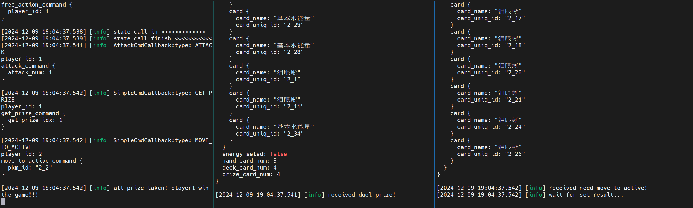

# PTCGCORE

## 目录:

-  [项目简介](#项目简介)
-  [使用指南](#使用指南)
-  [调试工具](#调试工具)
-  [开发中](#开发中)

## 项目简介

这是一个 ptcg 模拟器，旨在提供基于c++的高效 ptcg 模拟服务，从而进一步使用强化学习等方法来实现自动打牌的人工智能。

### 目录结构

```
.
├── app/                 应用层，对战服务器与sample AI（基于规则）
├── buff/                描述卡牌 buffer 的类
├── build/               存储 cmake 的编译结果
├── card/                卡牌类、卡牌工厂类
│   └── impl/            卡牌实例，使用 protobuf 描述
├── CMakeLists.txt       编译配置
├── common/              一些基本的功能函数
├── compile.sh           编译脚本
├── config/              配置文件
├── cost/                描述卡牌 cost 的类
├── kill.sh              结束任务脚本
├── place/               双方场上卡牌的管理类
├── proto/               卡牌、指令等结构的定义
├── proto_out            proto 文件夹的编译结果
├── Readme.md            Readme
├── tools/               一些相关工具
├── world.cc             管理与修改场上的卡牌信息的类，为对战服务器暴露接口
└── world.h
```

### 依赖

* 本项目的核心代码依赖 `CMake` 与 `protobuf`，log 系统依赖 `spdlog`
* 应用层部分（`./app` 文件夹内）依赖 `ROS2`
* 应用层与核心代码解耦，可以在不安装 `ROS2` 的情况下单独使用核心代码

## 使用指南
1. 使用 compile.sh 进行编译
```bash
bash compile.sh
```
2. 进入 `build` 目录
```bash
cd build/
```
3. 开 2 个窗格，分别执行如下语句：
```bash
./app/player_node player1 1  ### in window1
./app/player_node player2 2  ### in window2
```
4. 开一个新窗格，执行如下语句：
```bash
./app/world_node
```
* 不出意外的话，会有形如下图的 log 画面：

5. 等待运行完毕，使用 kill.sh 杀死进程结束任务
```bash
bash kill.sh
```

## 调试工具
### 对局数据解析工具
* TODO
### 可视化工具
* TODO

## 开发中

1. 对局的数据录制与解析的工具开发中
2. 可视化工具开发中
3. 基于强化学习的 AI 开发中
